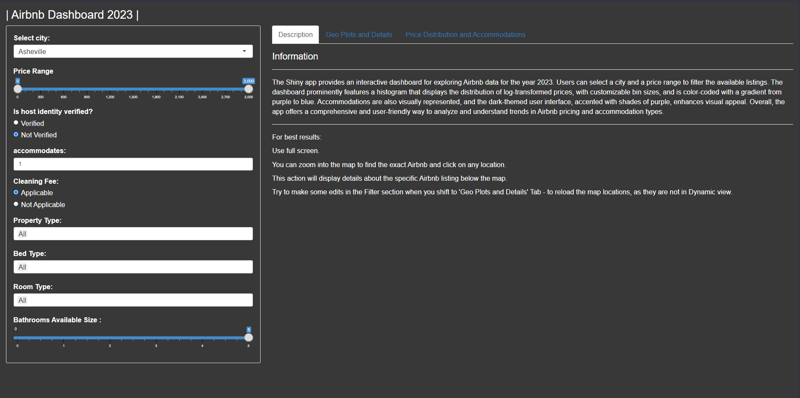
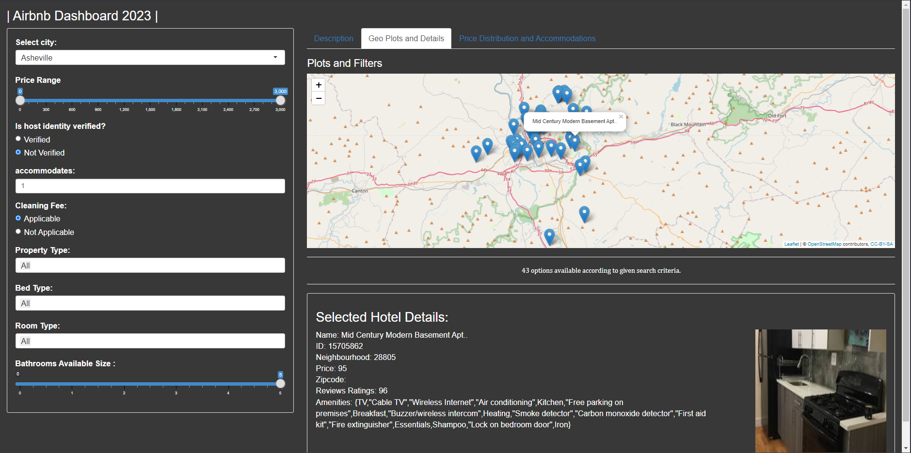
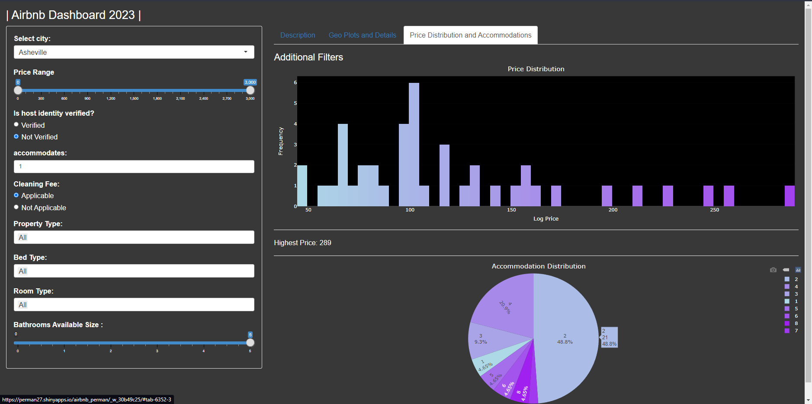

## Airbnb Dashboard 2023

A comprehensive Shiny application to explore Airbnb properties based on a variety of filters. With an intuitive user interface, users can quickly find properties that match their preferences.

### Features:

- **City Selection**: Filter properties by city.
- **Price Range**: Adjust the slider to set your budget.
- **Host Verification**: Choose whether you prefer hosts with verified identities.
- **Accommodation Size**: Select the number of people the property needs to accommodate.
- **Cleaning Fee Option**: Decide if you want a property with a cleaning fee.
- **Property Type**: Filter by the type of property (e.g., Apartment, Bed & Breakfast).

### Libraries Used:

- `shiny`: For building the web application.
- `leaflet`: For map-based visualizations.
- `readr`: Data reading utility.
- `dplyr`: For data manipulation.
- `ggplot2`: Graphing and visualization.
- `plotly`: Interactive plotting.

### Installation:

1. Clone the repository:

   ```
   git clone https://github.com/Ruthik27/Airbnb_2023_Dashboard
   ```

2. Navigate to the project directory and install the required R packages:

   ```R
   install.packages("shiny")
   install.packages("leaflet")
   install.packages("readr")
   install.packages("dplyr")
   install.packages("ggplot2")
   install.packages("plotly")
   ```

3. Run the Shiny app:
   ```R
   shiny::runApp()
   ```

### Screens
<br>



<br>



<br>



<br>

### Contributing:

Pull requests are welcome. For major changes, please open an issue first to discuss what you would like to change.

### License:

[MIT License](LICENSE)
